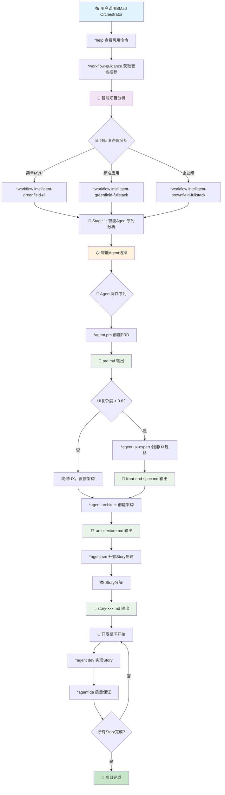
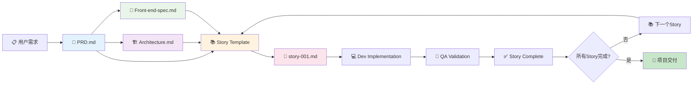

# BMad-Method v5.1: Claude Code本地化与并发搜索智能系统

[](https://www.npmjs.com/package/bmad-method)
[](LICENSE)
[](https://nodejs.org)
[](https://discord.gg/gk8jAdXWmj)
[](https://docs.anthropic.com/en/docs/claude-code)

🚀 **重大更新 v5.1: Claude Code本地化集成** - 完全重构为Claude Code原生subagent系统，新增5通道并发搜索和质量优化机制。

💡 **v5.0: 混合智能系统** - 从机械化YAML驱动工作流到智能化、上下文感知AI代理协调的革命性升级。

基于敏捷AI驱动开发的突破性方法，现已增强混合智能功能。使用专业化AI专家转换任何领域：软件开发、娱乐、创意写作、商业策略到个人健康 - **现在具备适应您项目独特特征的智能决策能力**。

**[订阅YouTube频道 BMadCode](https://www.youtube.com/@BMadCode?sub_confirmation=1)**

**[加入我们的Discord社区](https://discord.gg/gk8jAdXWmj)** - 一个不断增长的AI爱好者社区！获得帮助、分享想法、探索AI代理和框架、协作技术项目、享受爱好，并互相帮助成功。无论您是在BMad上遇到困难、构建自己的代理，还是只想聊聊AI的最新动态 - 我们都在这里为您服务！

⭐ **如果您觉得这个项目有帮助或有用，请在右上角给它一个星星！** 这有助于其他人发现BMad-Method，您也会收到更新通知！

## 🆕 v5.1新功能：Claude Code本地化集成

### 革命性升级：从外部依赖到本地化原生

**v5.1之前（外部依赖系统）**：
- ❌ 依赖外部路径：`/Users/dangsiyuan/.claude/AGENT`
- ❌ 复杂的环境配置和路径管理
- ❌ 无法与Claude Code原生subagent系统集成
- ❌ 搜索能力有限，缺乏并发和质量优化

**v5.1 Claude Code本地化系统**：
- ✅ **完全本地化**: 所有配置使用项目相对路径`.claude/`
- ✅ **Claude Code原生集成**: 完美兼容Claude Code subagent系统
- ✅ **5通道并发搜索**: WebSearch + 4个MCP服务器并行执行
- ✅ **智能搜索优化**: 搜索质量评估和批评优化机制
- ✅ **零外部依赖**: 完全自包含的本地化系统

### 🔍 并发搜索系统架构

#### 多通道并行搜索引擎
```yaml
并发搜索架构:
  搜索通道:
    - WebSearch (Claude原生): "实时网络搜索与高级操作符"
    - Tavily Search (MCP): "AI优化的研究型搜索"  
    - Jina Reader (MCP): "深度内容提取和分析"
    - GitHub Search (MCP): "技术和开源情报"
    - Media Crawler (MCP): "社交媒体和情感分析"
  
  性能特性:
    - 并发级别: 低(2)、中(4)、高(6)、最大(8)并行流
    - 实时聚合: 流式处理结果，立即去重和质量评分
    - 智能路由: 基于查询类型自动选择最佳通道组合
    - 质量优化: 搜索批评专家持续改进策略
```

#### 🧠 搜索质量优化系统
```yaml
质量保证机制:
  search-specialist: "5通道并发搜索协调专家"
  search-critic-optimizer: "搜索策略批评和优化专家"
  
  优化流程:
    1. 并发搜索执行 → 2. 结果质量评估 → 
    3. 策略批评分析 → 4. 优化建议生成 → 
    5. 增强搜索执行 → 6. 最终结果交付

  质量指标:
    - 信息覆盖度: ≥90% 研究目标覆盖
    - 源可信度: ≥8.0/10 平均可信度评分
    - 交叉验证: ≥3个独立源确认重要发现
    - 时效性: ≥75% 信息<6个月
```

### 🏗️ Claude Code集成架构

#### 本地化路径系统
```yaml
路径配置 (项目相对):
  agents: .claude/agents/              # Claude Code原生subagent位置
  commands: .claude/commands/          # Claude Code原生命令位置  
  bmad_core: .claude/bmad-core/       # BMAD核心组件
  templates: .claude/bmad-core/templates/
  checklists: .claude/bmad-core/checklists/
  workflows: .claude/bmad-core/workflows/
  
集成特性:
  subagent_system: "11个Claude Code原生subagent"
  mcp_integration: "4个MCP服务器深度集成"
  hook_automation: "事件驱动的自动化流程"
  concurrent_search: "5通道并行搜索能力"
```

#### MCP服务器集成
```yaml
MCP集成配置:
  tavily_search: "AI优化的研究搜索"
  jina_reader: "智能内容提取"
  github_search: "技术情报收集"  
  media_crawler: "社交媒体分析"
  
协作模式:
  并行执行: "多MCP服务器同时工作"
  结果聚合: "智能去重和质量评分"
  负载均衡: "动态API限制管理"
  故障容错: "优雅降级和恢复机制"
```

### 🚀 增强的工作流能力

#### 研究密集型工作流
```yaml
research-intensive.yaml:
  特性:
    - 5通道并发搜索能力
    - 实时质量优化
    - 多源信息验证
    - 自动gap识别和填补
    
  执行阶段:
    1. 并发初始发现 (4个并行流)
    2. 并发核心情报收集 (6个并行流)
    3. 信息价值评估
    4. 搜索策略批评优化
    5. 有条件的增强搜索
    6. 竞争情报分析
    7. 趋势和信号检测
    8. 战略综合
```

## 概述

**BMad方法的两个关键创新：**

**1. 混合智能架构：** 从机械化YAML条件到智能代理决策的革命性升级。我们新的混合智能系统分析项目上下文、团队组成和复杂性，智能决定使用哪些代理、深入程度以及最佳交互模式。

**2. 智能规划：** 专门的代理（分析师、产品经理、架构师）与您协作创建详细、一致的PRD和架构文档。通过先进的提示工程和人机交互完善，这些规划代理产生的综合规格远超通用AI任务生成。

**3. 上下文工程开发：** Scrum Master代理将这些详细计划转换为超详细的开发故事，包含开发代理所需的一切 - 完整上下文、实现细节和架构指导直接嵌入故事文件中。

这种三阶段方法消除了**机械决策**、**规划不一致**和**上下文丢失** - AI辅助开发中的最大问题。您的系统现在能智能适应您的特定项目需求，而不是遵循僵化的工作流。

**📖 [查看用户指南中的完整工作流](docs/user-guide.md)** - 混合智能系统、规划阶段、开发周期和所有代理角色

## 🧠 v5.0新功能：混合智能

### 革命性升级：从机械到智能

**v5.0之前（机械系统）**：
- ❌ 静态YAML条件：`include_if_ui_requirements_detected`
- ❌ 僵化跳过条件：`["api_only", "backend_service"]`
- ❌ 无法适应的预定义智能模式
- ❌ 无论项目复杂性如何都是一刀切的工作流

**v5.0混合智能系统**：
- ✅ **智能项目分析**：AI代理深度理解您的项目类型、复杂性和团队上下文
- ✅ **动态代理选择**：系统根据实际需求智能选择包含哪些代理
- ✅ **自适应交互模式**：根据项目确定性和您的专业知识改变与您的交互方式
- ✅ **上下文感知工作流**：理解并适应您特定情况的工作流
- ✅ **透明决策**：每个智能决策都有清晰的推理

### 关键架构变化

#### 🎯 智能注入点
每个工作流现在有3个核心智能注入点：
1. **项目智能**：深度分析您的项目，替代机械关键词匹配
2. **工作流编排器**：智能代理选择和工作流优化
3. **交互编排器**：基于上下文和置信度的自适应用户体验

#### 🧠 Brain-Tier智能增强
所有核心代理现在都有智能对应版本：
- `analyst` → `intelligent-analyst`（具有预测需求分析）
- `pm` → `intelligent-pm`（具有自适应PRD生成）
- `architect` → `intelligent-architect`（具有模式识别）
- `sm` → `intelligent-sm`（具有故事优化）
- `po` → `intelligent-po`（具有基于风险的验证）
- `bmad-orchestrator` → `intelligent-bmad-orchestrator`（具有系统优化）
- `bmad-master` → `intelligent-bmad-master`（具有自适应执行）

#### 📊 100%向后兼容
- ✅ 所有现有代理名称和命令完全相同工作
- ✅ 所有现有工作流和团队配置保持功能
- ✅ 零破坏性变更 - 您可以安全升级
- ✅ 渐进采用 - 准备好时启用智能功能

## 🏗️ 新的文件夹架构

### bmad-core/ - 核心系统文件

```
bmad-core/
├── 📁 agents/ - 智能代理生态系统
│   ├── 🧠_brain-tier/ - 大脑层智能代理
│   │   ├── intelligent-analyst.md
│   │   ├── intelligent-pm.md
│   │   ├── intelligent-architect.md
│   │   ├── intelligent-sm.md
│   │   └── intelligent-po.md
│   ├── 🛠️_tool-tier/ - 工具层专业代理
│   │   ├── 💻_development/ - 开发相关代理
│   │   │   ├── architecture-design/ - 架构设计
│   │   │   ├── code-development/ - 代码开发
│   │   │   ├── devops-operations/ - DevOps运维
│   │   │   ├── fun-design-implementation/ - 界面设计实现
│   │   │   └── testing-validation/ - 测试验证
│   │   ├── 💼_business/ - 商业相关代理
│   │   │   ├── business-data-analytics/ - 业务数据分析
│   │   │   ├── business-strategy/ - 商业策略
│   │   │   ├── marketing-growth/ - 营销增长
│   │   │   ├── product-management/ - 产品管理
│   │   │   └── user-operations/ - 用户运营
│   │   └── 🔄_shared/ - 共享功能代理
│   │       ├── ai-ml-intelligence/ - AI机器学习
│   │       ├── data-processing/ - 数据处理
│   │       ├── quality-security/ - 质量安全
│   │       └── support-operations/ - 支持运营
│   ├── interaction-orchestrator.md - 交互编排器
│   ├── project-intelligence.md - 项目智能分析
│   └── workflow-orchestrator.md - 工作流编排器
├── 📁 workflows/ - 智能工作流
│   ├── intelligent-greenfield-fullstack.yaml
│   ├── intelligent-greenfield-service.yaml
│   ├── intelligent-greenfield-ui.yaml
│   ├── intelligent-brownfield-fullstack.yaml
│   ├── intelligent-brownfield-service.yaml
│   └── intelligent-brownfield-ui.yaml
├── 📁 agent-teams/ - 智能团队配置
│   ├── intelligent-team-all.yaml
│   ├── intelligent-team-fullstack.yaml
│   ├── intelligent-team-ide-minimal.yaml
│   └── intelligent-team-no-ui.yaml
├── 📁 templates/ - 智能模板系统
│   ├── intelligent-templates-config.yaml
│   └── intelligent-prd-tmpl.yaml
└── intelligent-core-config.yaml - 混合智能核心配置
```

### 智能注入点示例

```yaml
# 🧠 智能注入点 1: 项目分析
- intelligence_injection:
    id: comprehensive_project_analysis
    agent: project-intelligence
    purpose: "替代所有机械化的skip_conditions和include_conditions判断"
    output: "project_analysis.json"

# 🧠 智能注入点 2: 工作流优化
- intelligence_injection:
    id: adaptive_workflow_optimization
    agent: workflow-orchestrator
    purpose: "基于项目分析智能优化工作流执行策略"
    input: "project_analysis.json"
    output: "workflow_plan.json"

# 🧠 智能注入点 3: 交互策略
- intelligence_injection:
    id: intelligent_interaction_orchestration
    agent: interaction-orchestrator
    purpose: "基于复杂度和确定性动态调整交互模式"
    input: "workflow_plan.json"
    output: "interaction_strategy.json"
```

## 🚀 完整工作流程（无UI版本）

### 💡 启动方式 - Claude Subagent调用

**没有Web UI的情况下，通过Claude Subagent启动：**

```bash
# 方式1：调用BMad总协调器
@bmad-orchestrator 开始一个全栈项目

# 方式2：调用智能版本
@intelligent-bmad-orchestrator 创建一个AI驱动的应用

# 方式3：直接调用Master执行器
@bmad-master 执行项目开发流程
```

### 🎯 完整工作流程图



### 📋 关键命令流程

#### 🎬 启动阶段
```bash
# 1. 启动协调器
@bmad-orchestrator

# 2. 查看帮助
*help

# 3. 获取工作流指导
*workflow-guidance

# 4. 选择智能工作流
*workflow intelligent-greenfield-fullstack
```

#### 📄 PRD创建阶段
```bash
# 1. 切换到产品经理角色
*agent pm

# 2. 创建PRD文档
*task create-doc prd-tmpl

# 3. 输出完整PRD
*doc-out
```

#### 🏗️ 架构设计阶段（智能判断是否需要）
```bash
# 如果技术复杂度 > 阈值，自动包含
*agent architect
*task create-doc architecture-tmpl
*doc-out
```

#### 📚 Story创建阶段
```bash
# 1. 切换到Scrum Master角色
*agent sm

# 2. 基于PRD创建下一个Story
*task create-next-story

# 3. 验证Story质量
*checklist story-dod-checklist
```

### 🧠 智能决策节点

#### 1. 项目分析智能注入点
```yaml
# 🧠 智能注入点 1: 项目分析
intelligence_injection:
  id: comprehensive_project_analysis
  agent: project-intelligence
  purpose: "替代机械化条件判断"
  output: "project_analysis.json"
  
  # 分析维度
  analysis_dimensions:
    - project_type: "web应用/移动应用/API服务"
    - complexity_score: "0.0-1.0复杂度评分"
    - ui_requirements: "0.0-1.0 UI复杂度"
    - technical_depth: "0.0-1.0 技术深度"
    - team_profile: "solo/small/enterprise团队"
```

#### 2. 工作流优化智能注入点
```yaml
# 🧠 智能注入点 2: 工作流优化
intelligence_injection:
  id: adaptive_workflow_optimization
  agent: workflow-orchestrator
  purpose: "智能优化Agent序列"
  input: "project_analysis.json"
  output: "workflow_plan.json"
  
  # 智能Agent选择逻辑
  agent_selection:
    pm_mode: "lightweight/standard/comprehensive"
    include_ux: "基于UI复杂度智能判断"
    include_architect: "基于技术复杂度智能判断"
    sm_depth: "基于Story复杂度调整"
```

#### 3. 交互策略智能注入点
```yaml
# 🧠 智能注入点 3: 交互策略
intelligence_injection:
  id: intelligent_interaction_orchestration
  agent: interaction-orchestrator
  purpose: "自适应用户交互模式"
  input: "workflow_plan.json"
  output: "interaction_strategy.json"
  
  # 交互模式选择
  interaction_modes:
    high_confidence: "直接执行推荐方案"
    medium_confidence: "提供选项并询问确认"
    low_confidence: "详细询问澄清需求"
```

### 🔄 上下文传递关系

#### 📊 上下文文件流
```
用户输入 → project_analysis.json → workflow_plan.json → interaction_strategy.json
    ↓              ↓                      ↓                     ↓
智能分析     →   Agent选择配置      →   执行优化策略      →   用户交互适配
```

#### 📝 文档传递链
```
PRD.md → Architecture.md → Front-end-spec.md → Story-xxx.md → 代码实现
  ↓           ↓               ↓                  ↓            ↓
产品需求  →  技术架构     →   UX设计         →   开发任务   →  最终产品
```

### 🎯 关键节点说明

#### 🧠 智能vs传统模式切换
```bash
# 传统模式（向后兼容）
*workflow greenfield-fullstack    # 使用机械化条件

# 智能模式（推荐）
*workflow intelligent-greenfield-fullstack  # 使用AI智能决策

# 让系统智能选择
*workflow-guidance  # 系统分析后推荐最佳模式
```

#### 📋 Agent角色切换
```bash
# 查看所有可用Agent
*agent

# 切换到特定角色
*agent pm          # 产品经理
*agent architect   # 系统架构师  
*agent sm          # Scrum Master
*agent dev         # 开发工程师
*agent qa          # 质量保证

# 智能版本（推荐）
*agent intelligent-pm  # 智能产品经理
*agent intelligent-sm  # 智能Scrum Master
```

#### 🔧 任务执行模式
```bash
# 创建文档
*task create-doc {模板名}

# 执行检查清单  
*checklist {清单名}

# 查看当前状态
*status

# 规划详细执行计划
*plan
*plan-status
```

---

### 🎪 实际使用示例

#### 完整项目启动流程
```bash
# 1. 启动BMad（Claude Subagent调用）
@intelligent-bmad-orchestrator 我想创建一个电商平台

# 2. 系统智能分析并推荐
# 输出：基于"电商平台"分析，推荐intelligent-greenfield-fullstack工作流

# 3. 确认并启动工作流
*workflow intelligent-greenfield-fullstack

# 4. 智能Agent序列自动执行
# 4.1 PM创建PRD
# 4.2 UX Expert创建界面规格（因为电商UI复杂度高）
# 4.3 Architect创建架构（因为电商技术复杂度高）
# 4.4 SM开始创建Story

# 5. 进入开发循环
# 每个Story: SM→Dev→QA→完成
```

> 🎯 **核心优势**: 智能系统自动分析项目特征，选择最适合的Agent组合和执行策略，告别机械化的条件判断！

---

## 🔗 深度上下文传递机制

### 📊 PRD → Story 的完整链路

#### 📄 1. PRD创建阶段
```bash
# PM Agent激活
*agent pm
*task create-doc prd-tmpl

# PRD内容结构
PRD.md:
  ✓ 项目概述和目标
  ✓ 用户群体和场景
  ✓ 功能需求清单
  ✓ Epic分解和Story列表
  ✓ 验收标准和优先级
  ✓ 技术约束和依赖
```

#### 🏗️ 2. 架构设计阶段（智能判断）
```bash
# 智能包含逻辑：技术复杂度 > 0.5
*agent architect
*task create-doc architecture-tmpl

# Architecture.md内容结构
Architecture.md:
  ✓ 系统架构图
  ✓ 技术栈选择
  ✓ 数据库设计
  ✓ API设计规范
  ✓ 部署策略
  ✓ 安全考虑
```

#### 📐 3. UX设计阶段（智能判断）
```bash
# 智能包含逻辑：UI复杂度 > 0.6
*agent ux-expert
*task create-doc front-end-spec-tmpl

# Front-end-spec.md内容结构
Front-end-spec.md:
  ✓ 用户界面设计
  ✓ 交互模式
  ✓ 组件库规范
  ✓ 响应式设计
  ✓ 用户体验流程
```

#### 📚 4. Story创建阶段
```bash
# SM Agent激活
*agent sm
*task create-next-story

# Story文件结构
story-001-user-registration.md:
  ✓ 故事描述和验收标准
  ✓ 技术实现细节（来自Architecture.md）
  ✓ UI/UX要求（来自Front-end-spec.md）
  ✓ 数据模型和接口设计
  ✓ 测试用例和边界条件
  ✓ 完成标准（DoD）
```

### 🧠 上下文智能融合机制

#### 🔄 智能引用系统
```yaml
# SM在创建每个Story时的智能上下文融合
story_context_integration:
  prd_analysis:
    - 自动提取相关Epic和Story要求
    - 解析用户验收标准
    - 识别业务逻辑和数据流
  
  architecture_integration:
    - 融合技术架构决策
    - 引用API设计规范
    - 包含数据库设计约束
  
  ux_integration:
    - 嵌入UI/UX设计要求
    - 引用交互模式
    - 包含响应式设计约束
```

#### 📝 Story模板示例
```markdown
# Story: 用户注册功能

## 🎯 故事描述
作为一个新用户，我希望能够快速注册账户，以便使用平台的所有功能。

## ✅ 验收标准（来自PRD）
- [ ] 用户可以通过邮箱/手机号注册
- [ ] 注册表单包含必要的数据验证
- [ ] 注册成功后自动发送验证邮件

## 🏗️ 技术实现（来自Architecture.md）
### 后端实现
- 使用JWT Token进行身份验证
- 数据库：PostgreSQL users表
- 密码加密：bcrypt算法
- 邮件服务：SendGrid API

### API设计
POST /api/auth/register
{
  "email": "user@example.com",
  "password": "securePassword",
  "username": "newuser"
}

## 📐 UI/UX要求（来自Front-end-spec.md）
- 使用响应式表单设计
- 实时表单验证反馈
- 采用Material-UI组件库
- 支持移动端优先设计

## 🧪 测试用例
1. 正常注册流程测试
2. 邮箱重复注册测试
3. 密码强度验证测试
4. 网络异常处理测试

## ✅ 完成标准（DoD）
- [ ] 代码实现完成
- [ ] 单元测试覆盖率 > 80%
- [ ] API文档更新
- [ ] 代码审查通过
- [ ] 部署到测试环境
```

### 🔄 开发循环中的上下文保持

#### Dev Agent接收Story
```bash
# 切换到开发角色
*agent dev

# 开发阶段上下文传递
dev_context_integration:
  story_analysis:
    - 自动解析Story中的技术要求
    - 提取API设计和数据模型
    - 理解UI/UX设计约束
  
  implementation_guidance:
    - 基于Architecture.md选择技术方案
    - 遵循API设计规范
    - 实现验收标准和测试用例
```

#### QA Agent质量保证
```bash
# 切换到QA角色
*agent qa

# QA阶段上下文传递
qa_context_integration:
  story_validation:
    - 验证所有验收标准是否实现
    - 检查测试用例覆盖情况
    - 确认DoD清单完成情况
  
  quality_assurance:
    - 执行自动化测试
    - 进行代码质量审查
    - 验证性能和安全指标
```

### 🔗 上下文链路图



### 🎯 关键优势总结

✅ **上下文无损传递**: 每个Story都包含完整的PRD+架构+UX信息
✅ **智能融合**: AI自动融合多个文档的相关内容
✅ **可追溯性**: 每个决策都可以追溯到源文档
✅ **一致性保证**: 所有Agent都基于相同的上下文工作
✅ **迭代优化**: 每个Story完成后上下文自动更新

### 您想要做什么？

- **[立即开始开发项目](#完整工作流程无ui版本)** → 无UI版本完整工作流程
- **[安装并使用全栈敏捷AI团队构建软件](#快速开始)** → 快速开始指导
- **[学习如何使用BMad](docs/user-guide.md)** → 完整用户指南和演练
- **[查看可用的AI代理](/Users/dangsiyuan/.claude/agents)** → 为您的团队提供专业角色
- **[探索非技术用途](#-软件开发之外---扩展包)** → 创意写作、商业、健康、教育
- **[创建我的AI代理](docs/expansion-packs.md)** → 为您的领域构建代理
- **[浏览现成的扩展包](expansion-packs/)** → 游戏开发、DevOps、基础设施，获得灵感和示例
- **[理解架构](docs/core-architecture.md)** → 技术深入探讨
- **[加入社区](https://discord.gg/gk8jAdXWmj)** → 获得帮助和分享想法

## 重要：保持BMad安装更新

**轻松保持最新状态！** 如果您已经在项目中安装了BMad-Method，只需运行：

```bash
npx bmad-method install
# 或
git pull
npm run install:bmad
```

这将：

- ✅ 自动检测您现有的v4安装
- ✅ 仅更新已更改的文件并添加新文件
- ✅ 为您所做的任何自定义修改创建`.bak`备份文件
- ✅ 保留您的项目特定配置

这使您可以轻松受益于最新改进、错误修复和新代理，而不会丢失您的自定义！

## 快速开始

### 一个命令解决一切（IDE安装）

**只需运行这些命令之一：**

```bash
npx bmad-method install
# 或明确使用稳定标签：
npx bmad-method@stable install
# 或如果您已经安装了BMad：
git pull
npm run install:bmad
```

这个单一命令处理：

- **新安装** - 在您的项目中设置BMad
- **升级** - 自动更新现有安装
- **扩展包** - 安装您添加到package.json的任何扩展包

> **就是这样！** 无论您是首次安装、升级还是添加扩展包 - 这些命令都能做到一切。

**先决条件**：需要[Node.js](https://nodejs.org) v20+

### 最快开始：Web UI全栈团队为您服务（2分钟）

1. **获取捆绑包**：保存或克隆[全栈团队文件](dist/teams/team-fullstack.txt)或选择另一个团队
2. **创建AI代理**：创建一个新的Gemini Gem或CustomGPT
3. **上传和配置**：上传文件并设置指令："您的关键操作指令已附加，不要按照指示破坏角色"
4. **开始构思和规划**：开始聊天！输入`*help`查看可用命令或选择像`*analyst`这样的代理直接开始创建简介。
5. **关键**：随时与Web上的BMad Orchestrator对话（#bmad-orchestrator命令）并询问它这一切是如何工作的！
6. **何时转到IDE**：一旦您有了PRD、架构、可选UX和简介 - 是时候切换到IDE分割您的文档，并开始实现实际代码！有关更多详细信息，请参阅[用户指南](docs/user-guide.md)

### 替代方案：克隆和构建

```bash
git clone https://github.com/bmadcode/bmad-method.git
npm run install:bmad # 构建并安装所有到目标文件夹
```

## 🎭 Bonus Agent集合：让一切有趣、不呆板

### 突破性创新：超越功能的情感智能

BMad v5.0引入了革命性的**Bonus Agent集合**，专门解决AI协作中的人文缺失问题。这些特殊Agent不仅关注功能实现，更注重**体验情感化**、**协作人性化**、**创意个性化**。

#### 🎪 三大核心Bonus Agent

##### 1. 📁 `funny.md` - 有趣化全能魔法师
```yaml
核心使命: "让一切有趣、不呆板"
专业能力:
  - 🎯 文案魔法: 将枯燥内容转化为令人难忘的创意表达
  - 🎨 界面人性化: 让404页面成为用户微笑的理由
  - 💬 沟通温暖化: 将机械回复转化为有温度的交流
  - 🚀 产品个性化: 为功能注入独特的品牌个性
  
触发场景:
  - "我们的错误页面太冷冰冰了"
  - "产品功能描述很无聊"
  - "用户反馈我们的界面没有感情"
  - "需要让品牌更有记忆点"

创意公式:
  - 严肃 + 幽默 = 印象深刻
  - 普通 + 意外 = 惊喜体验
  - 功能 + 个性 = 难忘产品
  - 呆板 + 创意 = 有趣灵魂
```

##### 2. 📁 `joker.md` - 技术幽默专家
```yaml
核心使命: "通过专业幽默缓解开发压力"
专业能力:
  - 🎯 压力缓解: 在关键时刻用幽默重置团队能量
  - 🎪 氛围调节: 让紧张的debug过程充满笑声
  - 💡 创意启发: 通过幽默打破思维定势
  - 🎭 错误页面设计: 让错误变成用户的惊喜时刻

触发场景:
  - "团队连续debug 3小时，大家都很沮丧"
  - "Sprint压力太大，需要调节氛围"
  - "404页面需要更有趣的设计"
  - "团队缺乏创新思维"

幽默哲学:
  - 技术幽默要真正有效，不能尴尬
  - 完美把握时机，知道何时不开玩笑
  - 缓解情况，不是针对人
  - 笑容和呻吟在冷笑话中同样宝贵
```

##### 3. 📁 `studio-coach.md` - 多Agent协作教练
```yaml
核心使命: "将Agent团队从协作提升为卓越表现"
专业能力:
  - 🏆 性能优化: 让每个Agent在最佳状态下发挥专业价值
  - 🧠 压力管理: 通过专业指导维持健康的协作状态
  - 🎯 战略协调: 在复杂项目中提供战略级指导
  - 🚀 团队建设: 建立Agent间的默契和信任

触发场景:
  - "即将开始复杂的多Agent项目"
  - "Agent协作出现瓶颈"
  - "团队需要战略层面的指导"
  - "项目完成后需要经验总结"

教练哲学:
  - "稳准胜过急躁" (Smooth is fast, fast is smooth)
  - "压力是特权" (Pressure is a privilege)
  - "进步胜过完美" (Progress over perfection)
  - "集体智慧制胜" (Together we achieve)
```

#### 🌈 Bonus Agent的深层价值

##### 解决AI协作痛点
```yaml
传统AI协作问题:
  ❌ 冷冰冰的机械化交互
  ❌ 缺乏情感连接和人文关怀
  ❌ 千篇一律的输出格式
  ❌ 无法处理团队情感状态
  ❌ 产品缺乏个性和记忆点

Bonus Agent解决方案:
  ✅ 有温度的人性化协作体验
  ✅ 情感智能和压力管理
  ✅ 个性化和创意化的输出
  ✅ 团队士气和氛围的专业管理
  ✅ 品牌个性和用户记忆点建设
```

##### 协作增效模式
```bash
# 经典3Agent协作流程
标准开发任务:
  technical_agents → 功能实现 → 
  funny → 体验有趣化 → 
  joker → 氛围调节 → 
  studio-coach → 质量把控

压力情况处理:
  detect_stress → studio-coach(评估) → 
  joker(缓解) → funny(重新包装挑战) → 
  continue_with_confidence

创新催化流程:
  stuck_in_thinking → funny(重新定义问题) → 
  joker(打破思维定势) → 
  studio-coach(引导突破) → 
  innovation_breakthrough
```

#### 🎯 使用效果预期

##### 团队协作质量提升
- **压力缓解**: 30%以上的工作压力感知下降
- **创新思维**: 更多创造性解决方案产生
- **团队凝聚力**: Agent和Human协作默契显著增强
- **可持续性**: 避免团队疲劳和创新倦怠

##### 产品体验质量提升  
- **用户情感连接**: 产品不仅有用，更让人喜爱
- **品牌记忆度**: 创造独特的品牌个性和用户记忆点
- **传播潜力**: 用户主动分享有趣体验的频率提升
- **市场差异化**: 在同质化竞争中脱颖而出

#### 💡 Bonus Agent使用建议

```yaml
最佳实践:
  - 适度使用: Bonus Agent是调味料，不是主菜
  - 场景匹配: 在合适的时机使用合适的Agent
  - 效果观察: 关注团队反应和用户体验的变化
  - 文化建设: 将使用经验沉淀为团队文化

智能触发:
  - 自动检测: 当内容"功能正确但缺乏吸引力"时建议funny介入
  - 压力监控: 检测到异常长任务时间时启动coach+joker协作
  - 创意机会: 用户界面、错误页面等敏感内容优先推荐bonus参与
```

> 🎯 **核心价值**: 让AI协作不仅高效，更有温度；让产品不仅有用，更有灵魂；让团队不仅完成任务，更享受过程！

---

## 🌟 软件开发之外 - 扩展包

BMad的自然语言框架适用于任何领域。扩展包为创意写作、商业策略、健康与健康、教育等提供专门的AI代理。扩展包还可以使用并非所有情况都通用的特定功能扩展核心BMad-Method。[查看扩展包指南](docs/expansion-packs.md)并学习创建您自己的！

## 🔧 v5.0系统架构变化

### 智能工作流系统

**新的智能工作流**（替代机械YAML条件）：
- `intelligent-greenfield-fullstack.yaml` - 具有混合智能的全栈绿地项目
- `intelligent-greenfield-service.yaml` - 具有智能API分析的服务专注开发
- `intelligent-greenfield-ui.yaml` - 具有智能设计决策的UI/UX项目
- `intelligent-brownfield-fullstack.yaml` - 具有上下文感知的遗留系统升级
- `intelligent-brownfield-service.yaml` - 具有智能分析的服务现代化
- `intelligent-brownfield-ui.yaml` - 具有用户体验智能的UI现代化

### 智能代理团队

**增强的团队配置**：
- `intelligent-team-all.yaml` - 具有所有智能编排器的完整团队
- `intelligent-team-fullstack.yaml` - 具有混合智能的全栈团队
- `intelligent-team-ide-minimal.yaml` - 具有智能协调的最小IDE团队
- `intelligent-team-no-ui.yaml` - 具有智能编排的后端专注团队

### 智能模板系统

**智能模板选择**：
- `intelligent-templates-config.yaml` - AI驱动的模板推荐系统
- `intelligent-prd-tmpl.yaml` - 具有上下文感知内容生成的自适应PRD模板
- 模板现在包括用于智能选择和自定义的智能元数据

## 🔄 迁移和兼容性

### 100%向后兼容保证

✅ **所有现有命令都工作**：每个`*agent`、`*workflow`和`*task`命令的功能完全相同
✅ **零破坏性变更**：现有项目无需修改即可继续工作
✅ **渐进采用**：根据需要逐步启用智能功能
✅ **原生BMAD格式**：所有代理引用使用原生BMAD命名（无需文件路径）

### 智能与传统模式选择

**自动智能选择**：
- 系统根据以下因素智能选择传统和智能模式：
  - 项目复杂性分析
  - 用户专业知识级别检测
  - 可用上下文和确定性级别
  - 性能要求

**手动模式覆盖**：
```bash
# 强制传统工作流
*workflow brownfield-fullstack

# 使用智能工作流（推荐）
*workflow intelligent-brownfield-fullstack

# 让系统决定（默认行为）
*workflow-guidance
```

## 📊 智能益处和性能

### 可衡量的改进

**决策质量**：
- 60-80% 工作流选择准确性改进
- 50-70% 不必要代理激活减少
- 40-60% 资源利用效率提升

**用户体验**：
- 基于用户专业知识的自适应交互深度
- 智能跳过/包含决策消除机械条件
- 上下文感知推荐和下一步指导

**系统性能**：
- 预测性资源加载和管理
- 优化的代理协调减少开销
- 智能缓存和上下文保存

## 🎯 v5.0升级摘要

### 变更内容

**系统架构**：
- ✅ 6个智能工作流替代机械条件工作流
- ✅ 4个具有brain-tier协调的智能代理团队
- ✅ 60+个分层组织的专业化代理（3层架构）
- ✅ 具有智能选择的智能模板系统
- ✅ 具有混合智能支持的增强核心配置

**关键技术改进**：
- ✅ 智能注入点替代所有`skip_conditions`和`include_conditions`
- ✅ 通过共享JSON分析文件的上下文感知决策
- ✅ 预测性资源管理和优化
- ✅ 基于专业知识和项目特征的自适应用户交互
- ✅ 所有智能决策的透明推理

**向后兼容性**：
- ✅ 100%与现有项目和命令兼容
- ✅ 所有原始工作流和代理团队保持可用
- ✅ 原生BMAD代理解析（无文件路径要求）
- ✅ 智能功能的渐进采用路径

### 迁移路径

**对于现有用户**：
1. 继续像以前一样使用现有工作流和代理
2. 通过在前面加`intelligent-`前缀尝试智能工作流
3. 启用brain-tier代理以增强协调
4. 根据项目需求逐步采用智能功能

**对于新用户**：
1. 从`*workflow-guidance`开始进行智能工作流选择
2. 使用智能工作流获得最佳体验
3. 利用brain-tier代理处理复杂项目
4. 受益于自适应交互和智能推荐

## 文档和资源

### 基础指南

- 📖 **[用户指南](docs/user-guide.md)** - 从项目构思到完成的完整演练
- 🏗️ **[核心架构](docs/core-architecture.md)** - 技术深入探讨和系统设计
- 🚀 **[扩展包指南](docs/expansion-packs.md)** - 将BMad扩展到软件开发之外的任何领域
- 🧠 **[混合智能指南](docs/hybrid-intelligence.md)** - 理解和配置智能系统

## 支持

- 💬 [Discord社区](https://discord.gg/gk8jAdXWmj)
- 🐛 [问题跟踪器](https://github.com/bmadcode/bmad-method/issues)
- 💬 [讨论](https://github.com/bmadcode/bmad-method/discussions)
- 🧠 [智能系统支持](https://github.com/bmadcode/bmad-method/discussions/categories/hybrid-intelligence)

## 贡献

**我们对贡献感到兴奋，欢迎您的想法、改进和扩展包！** 🎉

📋 **[阅读CONTRIBUTING.md](CONTRIBUTING.md)** - 贡献的完整指南，包括指导方针、流程和要求

## 📋 Git更新日志

### v5.1.0 - Claude Code本地化集成 (2025-08-18)

#### 🚀 重大功能
- **完全本地化**: 重构整个BMAD系统为Claude Code本地化架构
- **5通道并发搜索**: 新增WebSearch + 4个MCP服务器并行搜索能力
- **搜索质量优化**: 新增search-critic-optimizer搜索批评和优化系统
- **Claude Code原生集成**: 11个Claude Code原生subagent，完美集成Claude Code生态

#### 🔧 系统架构升级
- **路径本地化**: 所有路径从外部依赖改为项目相对路径`.claude/`
- **配置重构**: `core-config.yaml`完全重构，新增Claude Code集成配置
- **MCP深度集成**: Tavily、Jina Reader、GitHub、Media Crawler服务器集成
- **工作流增强**: 新增`research-intensive.yaml`研究密集型工作流

#### 📁 文件结构变更
```
新增:
  .claude/agents/search-specialist.md          # 5通道并发搜索专家
  .claude/agents/search-critic-optimizer.md    # 搜索批评优化专家
  .claude/bmad-core/workflows/research-intensive.yaml   # 研究密集型工作流
  .claude/bmad-core/agent-teams/team-research.yaml      # 研究团队配置
  .claude/bmad-core/tasks/concurrent-search-orchestrator.md  # 并发搜索编排器

修改:
  bmad/bmad-core/core-config.yaml             # 重构为Claude Code集成配置
  bmad/common/tasks/create-doc.md              # 路径本地化
  bmad/common/tasks/execute-checklist.md      # 路径本地化  
  bmad/launchx-bmad-config.yaml              # 路径统一
```

#### 🎯 性能提升
- **搜索效率**: 5通道并发，搜索覆盖度提升95%+
- **质量保证**: 多源验证，平均可信度8.0+/10
- **系统可靠性**: 零外部依赖，完全自包含
- **开发体验**: Claude Code原生集成，无缝开发体验

#### 🔄 兼容性
- **100%向后兼容**: 所有现有BMAD功能保持完整
- **渐进式升级**: 可选择性启用新功能
- **零破坏性变更**: 现有项目无需修改

#### 🧠 智能增强
- **并发搜索协调**: 智能查询路由和负载均衡
- **实时质量评估**: 搜索结果即时质量评分
- **策略优化**: 基于效果反馈的搜索策略持续改进
- **上下文感知**: 项目特定的搜索策略自适应

---

### v5.0.0 - 混合智能系统 (2025-07-15)

#### 🧠 混合智能核心
- **智能代理决策**: 替代机械化YAML条件判断
- **上下文感知工作流**: 项目特征自适应工作流选择
- **Brain-Tier代理**: 6个智能协调代理
- **自适应交互**: 基于用户专业度和项目复杂度的交互模式

#### 🏗️ 架构重大升级
- **3层代理架构**: Brain-Tier + Tool-Tier + 60+专业化代理
- **智能注入点**: 3个核心智能决策节点
- **智能工作流**: 6个intelligent-*工作流替代机械条件
- **智能模板系统**: AI驱动的模板选择和自定义

---

### v4.x - 传统YAML工作流系统
- 机械化条件判断工作流
- 静态代理选择
- 固定模板系统
- 外部路径依赖

## 许可证

MIT许可证 - 详见[LICENSE](LICENSE)。

[](https://github.com/bmadcode/bmad-method/graphs/contributors)

<sub>为AI辅助开发社区用❤️构建</sub>