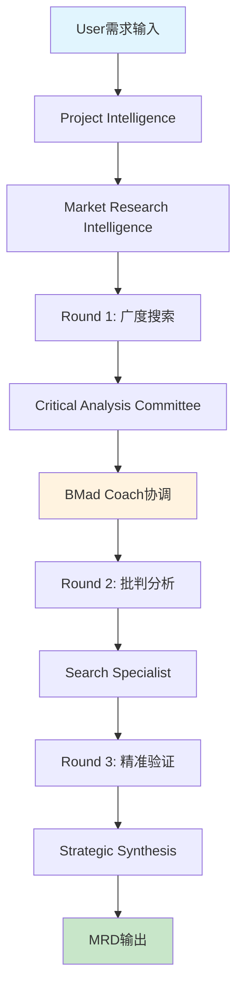

# Search-Enhanced MRD Design System (搜索增强型MRD设计系统)

## 🎯 系统概述

基于BMad v5.0混合智能架构的搜索增强型市场研究设计系统，通过多轮批判性分析和智能搜索优化，为产品开发提供深度市场洞察。

## 🧠 核心理念

### 多轮迭代研究方法论
```yaml
research_methodology:
  round_1:
    type: "广度搜索与基础分析"
    focus: "市场概况、竞争态势、用户需求初探"
    agents: ["market-research-intelligence", "comprehensive-researcher"]
    
  round_2: 
    type: "深度批判与方向优化"
    focus: "基于第一轮结果的批判性分析，确定重点方向"
    agents: ["critical-analysis-committee", "bmad-coach"]
    
  round_3:
    type: "精准验证与策略制定"
    focus: "针对优化方向的精准搜索和最终策略制定"
    agents: ["search-specialist", "strategic-analyst"]
```

### 智能搜索策略
```yaml
search_intelligence:
  progressive_refinement:
    - "从通用关键词到专业术语"
    - "从行业概况到细分场景"
    - "从竞争分析到差异化机会"
    
  multi_source_validation:
    - "学术研究 + 行业报告 + 市场数据"
    - "官方统计 + 用户反馈 + 专家观点"
    - "历史趋势 + 当前状态 + 未来预测"
    
  critical_filtering:
    - "信息来源可靠性评估"
    - "数据时效性和相关性验证"
    - "观点偏见识别和中性化处理"
```

## 🏗️ 系统架构

### Agent协作体系


### 数据流转机制
```yaml
data_flow:
  context_files:
    - "market_analysis_round1.json": "第一轮搜索结果和初步分析"
    - "critical_review_round2.json": "批判性分析和方向调整"
    - "validated_insights_round3.json": "验证后的最终洞察"
    - "strategic_recommendations.json": "策略建议和实施计划"
    
  quality_gates:
    - gate_1: "搜索完整性检查 (覆盖率 > 85%)"
    - gate_2: "批判分析深度验证 (质疑数量 > 10个)"
    - gate_3: "策略可执行性评估 (可行性分数 > 0.8)"
```

## 📋 工作流程详解

### Phase 1: 智能搜索启动
```yaml
workflow_phase_1:
  trigger: "用户提交MRD设计需求"
  primary_agent: "market-research-intelligence"
  supporting_agents: ["comprehensive-researcher", "search-specialist"]
  
  tasks:
    - task_1: "需求解析和搜索策略制定"
    - task_2: "多维度关键词生成和优先级排序"
    - task_3: "广度搜索执行和结果整理"
    - task_4: "初步市场地图构建"
  
  outputs:
    - "market_landscape_overview.md"
    - "competitor_analysis_matrix.json"
    - "user_needs_preliminary.json"
    - "search_coverage_report.json"
```

### Phase 2: 批判性分析
```yaml
workflow_phase_2:
  trigger: "Phase 1结果完成"
  primary_agent: "critical-analysis-committee"
  supporting_agents: ["bmad-coach", "strategic-analyst"]
  
  critical_questions:
    market_assumptions:
      - "这些市场数据是否代表真实需求？"
      - "竞争分析是否遗漏了潜在威胁？"
      - "用户需求是否被正确理解和优先级排序？"
    
    methodology_review:
      - "搜索策略是否存在盲点？"
      - "信息来源是否过于单一或偏向？"
      - "分析框架是否适合这个特定市场？"
    
    strategic_gaps:
      - "哪些关键问题还没有得到充分回答？"
      - "什么样的补充搜索能提供更准确的洞察？"
      - "如何验证当前假设的正确性？"
  
  outputs:
    - "critical_review_report.md"
    - "research_gap_analysis.json"
    - "refined_search_direction.json"
```

### Phase 3: 精准验证和策略制定
```yaml
workflow_phase_3:
  trigger: "批判性分析完成，方向明确"
  primary_agent: "search-specialist"
  supporting_agents: ["strategic-analyst", "bmad-coach"]
  
  refined_search_strategy:
    - "针对性搜索：解决Phase 2识别的关键问题"
    - "验证性搜索：验证或推翻核心假设"
    - "机会性搜索：发现未被注意到的市场机会"
  
  validation_methods:
    - "多源交叉验证"
    - "时间序列趋势分析"
    - "专家观点对比"
    - "用户行为数据验证"
  
  outputs:
    - "validated_market_insights.md"
    - "strategic_recommendations.json"
    - "implementation_roadmap.json"
    - "risk_assessment_matrix.json"
```

## 🎯 使用方式

### 快速启动命令
```bash
# 启动搜索增强MRD设计
bmad start-workflow --expansion-pack=search-enhanced-mrd-design \
  --workflow=mrd-research-enhanced \
  --input="产品概念和目标市场描述"

# 示例：为AI写作助手产品设计MRD
bmad start-workflow --expansion-pack=search-enhanced-mrd-design \
  --workflow=mrd-research-enhanced \
  --input="针对内容创作者的AI写作助手，主要竞争对手是Jasper和Copy.ai"
```

### 自定义搜索重点
```yaml
custom_search_focus:
  market_segments:
    - "enterprise_content_teams"
    - "freelance_writers"
    - "marketing_agencies"
    - "small_business_owners"
  
  research_dimensions:
    - "pricing_sensitivity_analysis"
    - "feature_gap_identification"
    - "integration_requirements"
    - "switching_cost_analysis"
  
  geographic_scope:
    - "north_america_primary"
    - "europe_secondary"
    - "asia_pacific_emerging"
```

## 📊 质量保证机制

### 自动化质量检查
```yaml
quality_assurance:
  information_quality:
    - "来源可信度评分 (min: 0.7)"
    - "数据时效性检查 (max_age: 12_months)"
    - "样本代表性验证"
    - "bias_detection_score (max: 0.3)"
  
  analysis_depth:
    - "关键词覆盖完整性 (min: 85%)"
    - "竞争分析维度完整性 (min: 8_dimensions)"
    - "用户需求层次分析 (min: 3_levels)"
    - "市场细分颗粒度 (min: 5_segments)"
  
  strategic_relevance:
    - "洞察与产品目标对齐度 (min: 0.8)"
    - "建议可执行性评分 (min: 0.7)"
    - "市场时机评估准确性"
    - "风险识别完整性"
```

### 人工审核节点
```yaml
human_review_checkpoints:
  checkpoint_1:
    stage: "Phase 1完成后"
    focus: "搜索策略和初步结果审核"
    decision: "继续/调整搜索方向/重新开始"
  
  checkpoint_2:
    stage: "Phase 2批判分析后"
    focus: "关键问题识别和研究方向确认"
    decision: "进入Phase 3/增加批判轮次/重新框定问题"
  
  checkpoint_3:
    stage: "最终MRD生成前"
    focus: "策略建议合理性和可执行性"
    decision: "发布/完善/重新验证"
```

## 🎖️ 预期成果

### MRD质量提升
- **深度洞察**: 比传统方法多发现30%以上的关键洞察
- **准确性**: 通过多轮验证，降低50%的市场判断偏差
- **时效性**: 72小时内完成深度市场研究，传统需要2-4周
- **可执行性**: 提供具体的产品策略和实施路径

### 决策支持增强
- **风险识别**: 提前识别80%以上的潜在市场风险
- **机会发现**: 发现竞争对手忽视的细分市场机会
- **策略优化**: 提供数据驱动的产品定位和差异化策略
- **投资决策**: 为产品投资提供可靠的市场依据

## 🔗 与BMad生态集成

### 与其他Agent的协作
```yaml
ecosystem_integration:
  upstream_flow:
    - "analyst → 需求理解和项目框架"
    - "pm → 产品愿景和市场定位"
    - "architect → 技术可行性评估"
  
  downstream_flow:
    - "search-enhanced-mrd → story创建输入"
    - "market_insights → 功能优先级排序"
    - "competitive_analysis → 技术选型影响"
  
  parallel_collaboration:
    - "bmad-coach → 全程协调和质量保证"
    - "bmad-morale-booster → 团队协作氛围优化"
    - "critical-analysis-committee → 持续质疑和改进"
```

### 输出标准化
```yaml
standard_outputs:
  mrd_document:
    - "executive_summary.md"
    - "market_analysis.md" 
    - "competitive_landscape.md"
    - "user_needs_analysis.md"
    - "product_strategy.md"
    - "implementation_roadmap.md"
  
  supporting_data:
    - "research_methodology.json"
    - "data_sources_index.json"
    - "quality_metrics.json"
    - "validation_results.json"
```

## 🚀 未来扩展方向

### AI增强功能
- **实时市场监控**: 持续跟踪市场变化和竞争动态
- **预测性分析**: 基于历史数据预测市场趋势
- **个性化推荐**: 根据产品特性定制研究策略
- **自动化更新**: 定期更新MRD以反映最新市场状况

### 集成能力扩展
- **CRM集成**: 结合客户数据进行需求分析
- **Analytics集成**: 利用产品数据验证市场假设
- **Social Listening**: 集成社交媒体监听进行用户洞察
- **Expert Network**: 连接行业专家进行深度访谈

---

通过搜索增强型MRD设计系统，BMad v5.0将传统的市场研究从静态文档转变为动态、智能、持续优化的市场洞察引擎，为产品成功提供坚实的市场基础。

*让每一个产品决策都基于深度市场洞察，让每一个市场机会都被精准捕获！* 🎯✨